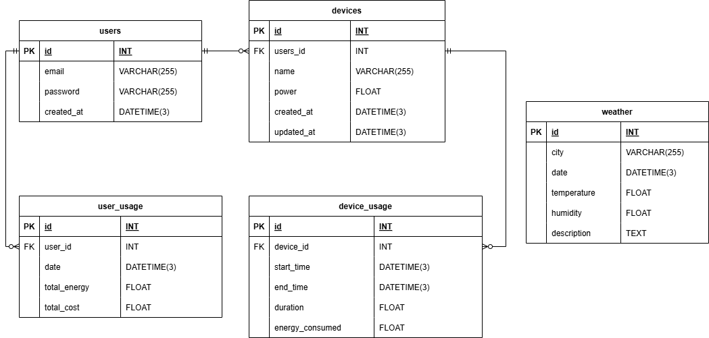
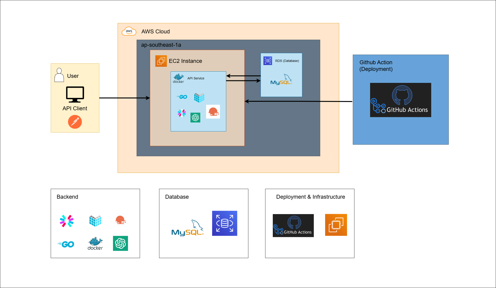

# Energia API Mini Project

Energia API adalah API sederhana yang dirancang untuk mengelola penggunaan perangkat listrik di rumah. Selain itu, API ini juga memberikan saran penggunaan perangkat berdasarkan informasi cuaca terkini.

---

## Entity Relationship Diagram (ERD)

Berikut adalah ERD yang digunakan dalam project ini:

---

## High-Level Architecture (HLA)

Berikut adalah High-Level Architecture (HLA) dari Energia API:

---

## Host untuk Penggunaan API

Energia API telah dihosting di cloud sehingga Anda dapat menggunakannya tanpa instalasi tambahan. Anda dapat mengakses API melalui host berikut:

http://52.65.161.24

---

## Dokumentasi API

Dokumentasi API lengkap dapat diakses melalui Swagger pada route berikut:

/swagger/index.html#

Contoh URL jika menggunakan host di atas:

http://52.65.161.24/swagger/index.html#

Dokumentasi ini mencakup semua endpoint yang tersedia, termasuk detail tentang parameter, respons, dan contoh penggunaan.